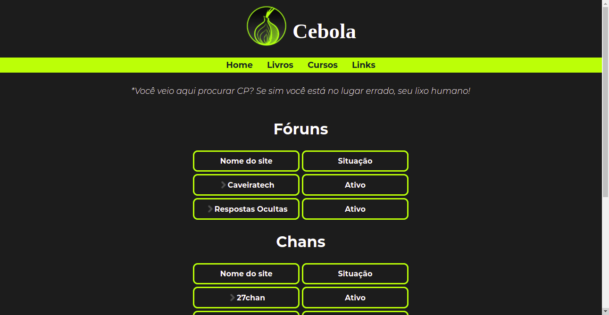

<h1>Cebola</h1>
<h2>Sobre o projeto Cebola</h2>

Essa página foi criada para facilitar a navegação na rede Onion. A rede Onion, como sabemos, faz parte das redes da Deep Web e, sua navegação é por links de sites dispersos ou por motores de busca muito pouco usuais.

O intuito do projeto é reunir o maior acervo possível de links de sites, dos mais diversos assuntos, mantendo-os sempre atualizados.

<h2>Layout do projeto</h2>

<h2>Tecnologias utilizadas</h2>

<ul>
  <li>HTML</li>
  <li>CSS</li>
  <li>Google Fonts</li>
</ul>

<h2>Autor</h2>

Yago Barcelos Barbosa

<a href="mailto:barbosayago004@gmail.com?subject=Contato">Email</a>
<a href="https://www.linkedin.com/in/ybarbosa/">Linkedin</a>
